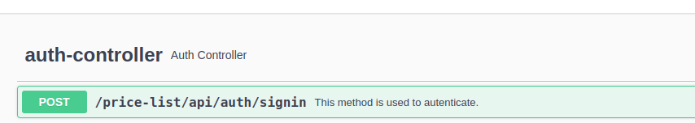
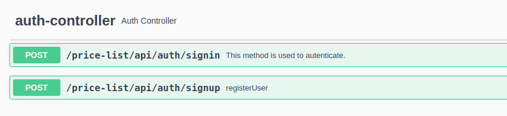

# Capitole Challenge Price API

>Java Challenge


## Github's project

- [view project](https://github.com/users/raul-varela/projects/1)

## Deployed on Railway

- [core-price](https://core-price-production-04f2.up.railway.app/price-list/swagger-ui/index.html)

## H2
```
BASE_URL: http://localhost:8082
or
BASE_URL: https://core-price-production.up.railway.app/
```

{BASE_URL}/price-list/h2/h2-console/

| Attribute         | Value         |
|:-----------|:--------------|
| `Driver Class`   | **org.h2.Driver**. |
| `jdbc url`  | **jdbc:h2:mem:price-db**. |
| `usr`      | **challenge**. |
| `pwd`      | **challenge**. |


* SELECT * FROM BRANDS


* SELECT * FROM PRICE_LISTS


* SELECT * FROM PRODUCTS


* SELECT * FROM USERS


## Swagger

El presente ejercicio implementa jwt para brindar una capa de seguridad a la invocación de la api solitada.
Por tal motivo es necesario ejecutar los siguiente endpoints como pre-requisitos:

* Signin - with Created User, get jwt and then ..
* Find Price By Brand & Product & Date

por otra parte se pueden crear usuarios nuevos, mediante el endoint
* Signup -  New User
*
```
BASE_URL: http://localhost:8082
```

{BASE_URL}/price-list/ui-swagger/index.html

## Postman

https://www.getpostman.com/collections/0e94422445bdeead8c08

## Curl

## API Reference

El presente ejercicio implementa jwt para brindar una capa de seguridad a la invocación de la api solitada.
Por tal motivo es necesario ejecutar los siguiente endpoints como pre-requisitos:

* Signin - with Created User, get jwt and then ..
* Find Price By Brand & Product & Date

por otra parte se pueden crear usuarios nuevos, mediante el endoint
* Signup -  New User

```
BASE_URL: http://localhost:8082
```

#### Signup -  New User

```http
  curl --location --request POST '{BASE_URL}/price-list/api/auth/signup' \
--header 'Content-Type: application/json' \
--data-raw '{
"username": "capitole",
"password": "123123",
"email": "capitole@server.com",
"role": [
"admin"
]
}'
```

| Parameter | Type       | Description                |
| :-------- |:-----------| :------------------------- |
| `username` | `string`   | **Required**.  |
| `password` | `string`   | **Required**.  |
| `email` | `string`   | **Required**.  |
| `role` | `string[]` | **Required**.  |


#### Signin - with a Created User

```http
curl --location --request POST '{BASE_URL}/price-list/api/auth/signin' \
--header 'Content-Type: application/json' \
--data-raw '{
"username": "capitole",
"password": "123123"
}'
```

| Parameter | Type       | Description                |
| :-------- |:-----------| :------------------------- |
| `username` | `string`   | **Required**.  |
| `password` | `string`   | **Required**.  |


#### Access Admin Menu

```http
curl --location --request GET '{BASE_URL}/price-list/api/test/admin' \
--header 'Authorization: Bearer {access_token}'
```

| Header     | Type       | Description                |
|:-----------|:-----------| :------------------------- |
| `Authorization` | `string`   | **Required**.  |


#### Find Price By Brand & Product & Date

```http

# Test 1: petición a las 10:00 del día 14 del producto 35455   para la brand 1 (ZARA)

curl --location --request POST '{BASE_URL}/price-list/api/v1/price/getPriceByProductAndDate' \
--header 'Authorization: Bearer {access_token}' \
--header 'Content-Type: application/json' \
--data-raw '{
"brandId": "1",
"productId": "35455",
"applicationTime": "2020-06-14 10:00:00"
}'

Test 2: petición a las 16:00 del día 14 del producto 35455   para la brand 1 (ZARA)


curl --location --request POST '{BASE_URL}/price-list/api/v1/price/getPriceByProductAndDate' \
--header 'Authorization: Bearer {access_token}' \
--header 'Content-Type: application/json' \
--data-raw '{
"brandId": "1",
"productId": "35455",
"applicationTime": "2020-06-14 16:00:00"
}'

Test 3: petición a las 21:00 del día 14 del producto 35455   para la brand 1 (ZARA)


curl --location --request POST '{BASE_URL}/price-list/api/v1/price/getPriceByProductAndDate' \
--header 'Authorization: Bearer {access_token}' \
--header 'Content-Type: application/json' \
--data-raw '{
"brandId": "1",
"productId": "35455",
"applicationTime": "2020-06-14 21:00:00"
}'

Test 4: petición a las 10:00 del día 15 del producto 35455   para la brand 1 (ZARA)


curl --location --request POST '{BASE_URL}/price-list/api/v1/price/getPriceByProductAndDate' \
--header 'Authorization: Bearer {access_token}' \
--header 'Content-Type: application/json' \
--data-raw '{
"brandId": "1",
"productId": "35455",
"applicationTime": "2020-06-15 10:00:00"
}'
Test 5: petición a las 21:00 del día 16 del producto 35455   para la brand 1 (ZARA)

curl --location --request POST '{BASE_URL}/price-list/api/v1/price/getPriceByProductAndDate' \
--header 'Authorization: Bearer {access_token}' \
--header 'Content-Type: application/json' \
--data-raw '{
"brandId": "1",
"productId": "35455",
"applicationTime": "2020-06-16 21:00:00"
}'
```
| Header     | Type       | Description                |
|:-----------|:-----------| :------------------------- |
| `Authorization` | `string`   | **Required**.  |

## Actuators

{BASE_URL}/price-list/actuator/


## Docker

```
docker build . -t challenge:v1.0

docker run -itd --name challenge -p 8082:8082 challenge:v1.0
```
